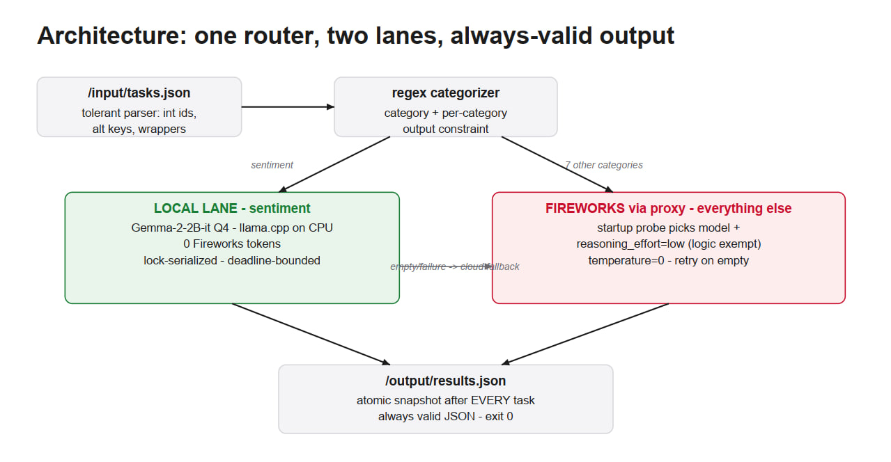

# AMD Smart Router

### Hybrid token-efficient routing for AMD Developer Hackathon ACT II · Track 1

AMD Smart Router is a containerized batch agent that answers a fixed set of
natural-language tasks while minimizing paid Fireworks inference. It routes
each task to the least expensive reliable path: a validated local Gemma lane
for sentiment classification, or a Fireworks model for the remaining task
categories.

> **Recorded hidden-evaluation result:** 100% accuracy · 8,262 Fireworks
> tokens (`v4-hybrid`)

The project is designed around one rule: token savings are valuable only after
the answer remains accurate enough to pass the competition gate.

## What the agent supports

The router recognizes eight task families:

| Category | Typical tasks | Production lane |
| --- | --- | --- |
| Factual knowledge | Definitions, explanations, general knowledge | Fireworks |
| Mathematical reasoning | Percentages, arithmetic, word problems | Fireworks |
| Sentiment | Positive / negative / neutral / mixed classification | Local Gemma, with cloud fallback |
| Summarisation | One-sentence and format-constrained summaries | Fireworks |
| Named entities | Person, organisation, location, and date extraction | Fireworks |
| Code debugging | Diagnose and correct a code snippet | Fireworks |
| Logical reasoning | Constraint and deduction puzzles | Fireworks |
| Code generation | Implement a function from a specification | Fireworks |

Unsupported or ambiguous prompts fail closed to the cloud path. A local answer
is used only when the category has passed the project’s judge-based routing
checks, and any local failure automatically falls back to Fireworks.

## Architecture

One flow: input → router → two lanes, merging into the output box. The
local→cloud fallback arrow is the detail worth noticing.



### Routing decisions are measured

- A startup probe measures model overhead, including hidden reasoning tokens.
- The selected model always comes from the runtime-provided `ALLOWED_MODELS`
  list; no catalog is hard-coded into the image.
- `reasoning_effort: low` is applied only when the endpoint accepts it and the
  task is not a logic puzzle. Full reasoning is retained for logic.
- Prompts receive short, category-specific output constraints.
- Requests use deterministic decoding (`temperature=0`), bounded timeouts, and
  one retry for transient failures or reasoning-exhausted empty output.
- Results are atomically rewritten after every completed task, so a late
  interruption still leaves valid JSON on disk.

## Container contract

The image reads `/input/tasks.json` at startup:

```json
[
  {
    "task_id": "t1",
    "prompt": "Summarise this text in one sentence: ..."
  },
  {
    "task_id": "t2",
    "prompt": "What is the capital of Australia?"
  }
]
```

It writes `/output/results.json` before exiting:

```json
[
  {"task_id": "t1", "answer": "..."},
  {"task_id": "t2", "answer": "..."}
]
```

The parser also tolerates integer IDs, alternate prompt keys (`question`,
`input`, `task`, `text`, `query`, `instruction`), and common list wrappers.
The output always preserves every usable input ID, including tasks that could
not be answered.

## Quick start

### Prerequisites

- Docker with Buildx
- A Fireworks API key for local development
- Python 3.11+ for the unit tests
- `curl` (or PowerShell `Invoke-WebRequest`) for the local GGUF download

### Configure local credentials

```bash
cp .env.example .env
```

Set the values in `.env`:

```dotenv
FIREWORKS_API_KEY=your_fireworks_key
FIREWORKS_BASE_URL=https://api.fireworks.ai/inference/v1
ALLOWED_MODELS=comma,separated,allowlisted,model,ids
```

The grading environment injects these variables at runtime. Do not commit a
real `.env` file or hard-code a model ID in the image.

### Download the local model

The GGUF is intentionally excluded from Git because of its size. From the
repository root:

```bash
mkdir -p models
curl -L \
  -o models/gemma-2-2b-it-Q4_K_M.gguf \
  "https://huggingface.co/bartowski/gemma-2-2b-it-GGUF/resolve/main/gemma-2-2b-it-Q4_K_M.gguf"
```

On PowerShell:

```powershell
New-Item -ItemType Directory -Force models | Out-Null
Invoke-WebRequest `
  -Uri "https://huggingface.co/bartowski/gemma-2-2b-it-GGUF/resolve/main/gemma-2-2b-it-Q4_K_M.gguf" `
  -OutFile "models/gemma-2-2b-it-Q4_K_M.gguf"
```

### Run the grading-style smoke test

```bash
./run_local.sh
```

The script builds a `linux/amd64` image, runs it with the competition’s
4 GB RAM / 2 vCPU limits, validates the output schema, and prints every
practice answer for a final human check.

## Run manually

```bash
mkdir -p input output
cp practice_tasks.json input/tasks.json

docker buildx build \
  --platform linux/amd64 \
  --load \
  -t routing-agent:local .

docker run --rm \
  --memory=4g \
  --cpus=2 \
  --env-file .env \
  -v "$PWD/input:/input" \
  -v "$PWD/output:/output" \
  routing-agent:local
```

Inspect `output/results.json` after the container exits. All Fireworks traffic
must go through `FIREWORKS_BASE_URL`; this is required for token accounting.

## Tests and evaluation

Install development dependencies and run the full unit suite:

```bash
python3 -m venv .venv
.venv/bin/pip install -r requirements-dev.txt
.venv/bin/pytest
```

The repository includes a 72-task golden set and a binary LLM-judge harness:

```bash
.venv/bin/python eval/local_judge.py output/results.json
```

The golden set is for local confidence only; the official evaluation uses
hidden prompts. Always inspect practice answers before using a submission slot.

## Build and publish a submission image

Build for the judge’s architecture and push an immutable, publicly pullable
tag:

```bash
docker buildx build \
  --platform linux/amd64 \
  -t <registry>/<user>/routing-agent:<tag> \
  --push .
```

The image must:

- include a `linux/amd64` manifest;
- be publicly pullable at scoring time;
- start within 60 seconds;
- finish within the 10-minute job limit;
- keep each response under the 30-second target;
- stay below the 10 GB compressed image limit.

## Repository map

```text
agent/                 Runtime router, model client, and local lane
eval/                  Golden-set judge and evaluation utilities
tests/                 Unit and hardening tests
docs/                  Design specifications and engineering plans
practice_tasks.json    Eight public smoke-test tasks
Dockerfile             linux/amd64 submission image
run_local.sh           Build, run, and schema-check helper
```

## Engineering notes

The implementation evolved through measured routing experiments rather than
static assumptions. The design documents record the baseline, hybrid router,
local-model judge gates, token accounting, and rejected experiments:

- `docs/superpowers/specs/2026-07-11-phase1-baseline-design.md`
- `docs/superpowers/specs/2026-07-12-phase2-hybrid-router-design.md`
- `docs/presentation.md`

## Hackathon context

Built for [AMD Developer Hackathon: ACT II](https://lablab.ai/ai-hackathons/amd-developer-hackathon-act-ii),
Track 1 — Hybrid Token-Efficient Routing Agent.

The project is a hackathon submission and is not intended to be used as a
general-purpose production gateway without additional operational controls.
